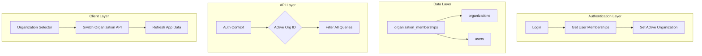

# Design Document: Multi-Organization Membership

## Overview

Esta funcionalidade permite que utilizadores pertençam a múltiplas organizações simultaneamente, alternando entre elas no aplicativo. Cada organização mantém dados financeiros isolados e a sua própria subscrição.

A implementação requer:
1. Nova tabela `organization_memberships` para relação N:N entre users e organizations
2. Campo `activeOrganizationId` no user para rastrear organização atual
3. Atualização de todas as APIs para usar `activeOrganizationId` do contexto
4. Interface de seleção de organização no mobile e web

## Architecture



## Components and Interfaces

### 1. Database Schema Changes

#### New Table: `organization_memberships`

```sql
CREATE TABLE organization_memberships (
  id SERIAL PRIMARY KEY,
  user_id INTEGER NOT NULL REFERENCES users(id) ON DELETE CASCADE,
  organization_id INTEGER NOT NULL REFERENCES organizations(id) ON DELETE CASCADE,
  role VARCHAR(50) NOT NULL DEFAULT 'member', -- 'owner', 'admin', 'member'
  joined_at TIMESTAMP DEFAULT NOW(),
  invited_by INTEGER REFERENCES users(id),
  created_at TIMESTAMP DEFAULT NOW(),
  updated_at TIMESTAMP DEFAULT NOW(),
  UNIQUE(user_id, organization_id)
);

CREATE INDEX idx_memberships_user ON organization_memberships(user_id);
CREATE INDEX idx_memberships_org ON organization_memberships(organization_id);
```

#### Modified Table: `users`

```sql
ALTER TABLE users 
  ADD COLUMN active_organization_id INTEGER REFERENCES organizations(id);

-- Remove organizationId after migration (or keep for backward compatibility)
-- ALTER TABLE users DROP COLUMN organization_id;
```

### 2. API Endpoints

#### Organization Management

```typescript
// GET /api/organizations/my
// Returns all organizations user belongs to
interface MyOrganizationsResponse {
  organizations: Array<{
    id: number;
    name: string;
    role: 'owner' | 'admin' | 'member';
    subscription: {
      planType: string;
      status: string;
    };
    memberCount: number;
    isActive: boolean; // true if this is activeOrganizationId
  }>;
}

// POST /api/organizations
// Create new organization
interface CreateOrganizationRequest {
  name: string;
  planId?: number; // Optional, defaults to free plan
}

// POST /api/organizations/switch
// Switch active organization
interface SwitchOrganizationRequest {
  organizationId: number;
}

// DELETE /api/organizations/:id/leave
// Leave an organization (members only, not owners)
```

#### Updated Auth Response

```typescript
interface AuthResponse {
  user: {
    id: number;
    email: string;
    firstName: string;
    lastName: string;
    activeOrganizationId: number;
    activeOrganization: {
      id: number;
      name: string;
      role: string;
      planType: string;
      subscriptionStatus: string;
    };
    memberships: Array<{
      organizationId: number;
      organizationName: string;
      role: string;
    }>;
  };
  token: string;
}
```

### 3. Service Layer Changes

#### OrganizationMembershipService

```typescript
class OrganizationMembershipService {
  // Get all memberships for a user
  static async getUserMemberships(userId: number): Promise<Membership[]>;
  
  // Add user to organization
  static async addMember(
    organizationId: number, 
    userId: number, 
    role: string,
    invitedBy?: number
  ): Promise<Membership>;
  
  // Remove user from organization
  static async removeMember(
    organizationId: number, 
    userId: number
  ): Promise<void>;
  
  // Check if user belongs to organization
  static async isMember(
    userId: number, 
    organizationId: number
  ): Promise<boolean>;
  
  // Get user's role in organization
  static async getRole(
    userId: number, 
    organizationId: number
  ): Promise<string | null>;
  
  // Switch active organization
  static async switchOrganization(
    userId: number, 
    organizationId: number
  ): Promise<void>;
}
```

#### Updated AuthService

```typescript
// Registration flow
async register(data: RegisterData): Promise<AuthResponse> {
  // 1. Create user
  const user = await UserRepository.create(data);
  
  // 2. Create default organization
  const org = await OrganizationRepository.create({
    name: `${data.firstName}'s Organization`,
    ownerId: user.id
  });
  
  // 3. Create membership (owner)
  await OrganizationMembershipService.addMember(
    org.id, 
    user.id, 
    'owner'
  );
  
  // 4. Set active organization
  await UserRepository.update(user.id, {
    activeOrganizationId: org.id
  });
  
  // 5. If registering via invitation, also add to inviting org
  if (data.invitationToken) {
    const invitation = await getInvitation(data.invitationToken);
    await OrganizationMembershipService.addMember(
      invitation.organizationId,
      user.id,
      invitation.role,
      invitation.invitedBy
    );
  }
  
  return { user, token };
}
```

### 4. Context/Middleware Updates

```typescript
// Updated auth middleware
async function authMiddleware(req, res, next) {
  const user = await verifyToken(req.headers.authorization);
  
  // Get active organization
  const activeOrgId = user.activeOrganizationId;
  
  // Verify user is member of active org
  const isMember = await OrganizationMembershipService.isMember(
    user.id, 
    activeOrgId
  );
  
  if (!isMember) {
    // Fallback to first available org
    const memberships = await OrganizationMembershipService.getUserMemberships(user.id);
    if (memberships.length > 0) {
      activeOrgId = memberships[0].organizationId;
      await UserRepository.update(user.id, { activeOrganizationId: activeOrgId });
    }
  }
  
  req.user = user;
  req.organizationId = activeOrgId;
  next();
}
```

### 5. Mobile UI Components

#### Organization Selector (Header Component)

```typescript
// Component shown in app header or profile
interface OrganizationSelectorProps {
  currentOrg: Organization;
  organizations: Organization[];
  onSwitch: (orgId: number) => void;
}

// Displays:
// - Current org name with dropdown arrow
// - On tap: shows list of all orgs with roles
// - Badge for subscription status
// - "Create New Organization" option at bottom
```

#### Organizations Management Screen

```typescript
// New screen in Profile stack
// Path: Profile > My Organizations

// Features:
// - List all organizations with role badges
// - Current org highlighted
// - Tap to switch
// - "Create Organization" button
// - For owners: "Manage Team" button
// - For members: "Leave Organization" button
```

## Data Models

### TypeScript Types

```typescript
interface OrganizationMembership {
  id: number;
  userId: number;
  organizationId: number;
  role: 'owner' | 'admin' | 'member';
  joinedAt: Date;
  invitedBy?: number;
  createdAt: Date;
  updatedAt: Date;
}

interface UserWithMemberships extends User {
  activeOrganizationId: number;
  memberships: OrganizationMembership[];
}

interface OrganizationWithSubscription extends Organization {
  subscription?: Subscription;
  memberCount: number;
  userRole: string;
}
```

### Drizzle Schema

```typescript
export const organizationMemberships = pgTable("organization_memberships", {
  id: serial("id").primaryKey(),
  userId: integer("user_id").references(() => users.id, { onDelete: 'cascade' }).notNull(),
  organizationId: integer("organization_id").references(() => organizations.id, { onDelete: 'cascade' }).notNull(),
  role: varchar("role", { length: 50 }).notNull().default('member'),
  joinedAt: timestamp("joined_at").defaultNow(),
  invitedBy: integer("invited_by").references(() => users.id),
  createdAt: timestamp("created_at").defaultNow(),
  updatedAt: timestamp("updated_at").defaultNow(),
}, (table) => ({
  uniqueMembership: unique().on(table.userId, table.organizationId),
  userIdx: index("idx_memberships_user").on(table.userId),
  orgIdx: index("idx_memberships_org").on(table.organizationId),
}));

// Add to users table
export const users = pgTable("users", {
  // ... existing fields
  activeOrganizationId: integer("active_organization_id").references(() => organizations.id),
});
```

## Correctness Properties

*A property is a characteristic or behavior that should hold true across all valid executions of a system—essentially, a formal statement about what the system should do. Properties serve as the bridge between human-readable specifications and machine-verifiable correctness guarantees.*

### Property 1: Multi-Membership Consistency

*For any* user with multiple organization memberships, querying their memberships should return all organizations they belong to, and each membership should have a valid role.

**Validates: Requirements 1.1, 1.4**

### Property 2: Registration Creates Owner Membership

*For any* new user registration, the system should create exactly one organization where the user is the owner, and the user should have exactly one membership with role 'owner' after registration.

**Validates: Requirements 1.2, 2.2**

### Property 3: Membership Operations Are Additive

*For any* user accepting an invitation or creating a new organization, their existing memberships should remain unchanged, and the total membership count should increase by exactly one.

**Validates: Requirements 1.3, 2.4**

### Property 4: Active Organization Persistence

*For any* user session, the active organization should persist across login/logout cycles, and switching organizations should update the active organization immediately.

**Validates: Requirements 3.2, 3.6**

### Property 5: Subscription Isolation

*For any* user belonging to multiple organizations with different subscription plans, feature access checks should use only the active organization's subscription, not any other organization's subscription.

**Validates: Requirements 4.3, 4.5**

### Property 6: Data Isolation by Organization

*For any* data creation or query operation, the data should be associated with and filtered by the active organization only. A user should never see or create data in an organization they don't belong to.

**Validates: Requirements 6.1, 6.2, 6.3**

### Property 7: Invitation Acceptance Preserves Account

*For any* existing user accepting an organization invitation, their user account should remain unchanged (same id, email, password), and they should gain exactly one new membership.

**Validates: Requirements 5.2, 5.4**

### Property 8: Role-Based Access Control

*For any* organization, only owners should be able to manage team members, and only non-owners should be able to leave the organization. Owners cannot leave their own organization.

**Validates: Requirements 7.4, 7.5**

### Property 9: Migration Role Preservation

*For any* existing user-organization relationship, after migration the user should have a membership record with the same role they had before migration.

**Validates: Requirements 8.3, 8.4**

## Error Handling

### Error Scenarios

| Scenario | Error Code | Message | Action |
|----------|------------|---------|--------|
| Switch to non-member org | 403 | "You are not a member of this organization" | Reject switch |
| Owner tries to leave | 400 | "Owners cannot leave their organization. Transfer ownership first." | Reject leave |
| Create org without plan | 400 | "Please select a subscription plan" | Show plan selection |
| Access data from other org | 403 | "Access denied" | Return empty/error |
| Duplicate membership | 409 | "User is already a member" | Ignore or update role |
| Invalid invitation token | 404 | "Invitation not found or expired" | Show error |

### Fallback Behaviors

1. **No Active Organization**: If user's activeOrganizationId is null or invalid, fallback to first available membership
2. **No Memberships**: Should never happen (registration creates one), but if it does, force user to create organization
3. **Deleted Organization**: Remove membership, switch to another org if available

## Testing Strategy

### Unit Tests

1. **OrganizationMembershipService**
   - `addMember` creates membership with correct role
   - `removeMember` deletes only specified membership
   - `isMember` returns correct boolean
   - `switchOrganization` updates activeOrganizationId

2. **AuthService**
   - Registration creates user + org + membership
   - Login returns all memberships
   - Invitation registration creates 2 memberships

3. **Data Services**
   - All queries filter by organizationId
   - Create operations use activeOrganizationId

### Property-Based Tests

Using a property-based testing library (e.g., fast-check for TypeScript):

1. **Property 1**: Generate random users with random number of memberships, verify all are returned
2. **Property 3**: Generate membership operations, verify count changes correctly
3. **Property 6**: Generate data operations, verify organization isolation
4. **Property 8**: Generate role-based operations, verify access control

### Integration Tests

1. **Full Registration Flow**: Register → Verify org created → Verify membership
2. **Invitation Flow**: Invite → Accept → Verify 2 memberships
3. **Switch Organization**: Create 2 orgs → Switch → Verify data changes
4. **Leave Organization**: Join org → Leave → Verify membership removed

### Migration Tests

1. Run migration on test database with existing data
2. Verify all users have membership records
3. Verify roles are preserved
4. Verify activeOrganizationId is set correctly
