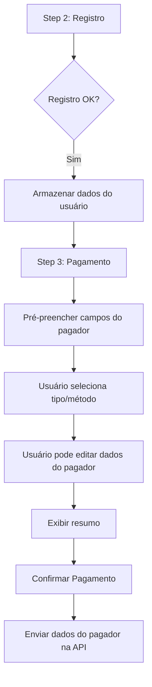

# Design Document: Public Subscription Payer Form

## Overview

Este documento descreve o design para melhorar o formulário de pagamento no fluxo de onboarding público, alinhando-o com a experiência do modal de pagamento da página de assinatura para usuários logados. A principal mudança é adicionar um formulário de dados do pagador no Step 3 (Pagamento) que carrega automaticamente os dados do usuário registrado e permite alteração para casos onde outra pessoa irá efetuar o pagamento.

## Architecture

A implementação será feita exclusivamente no frontend, modificando o componente `OnboardingPage`. Não há necessidade de alterações no backend, pois o endpoint `/api/subscriptions/subscribe` já aceita os parâmetros `payerPhone`, `payerName` e `payerEmail`.



## Components and Interfaces

### Estado do Componente (Novos campos)

```typescript
// Dados do pagador (novos estados)
const [payerPhone, setPayerPhone] = useState('');
const [payerName, setPayerName] = useState('');
const [payerEmail, setPayerEmail] = useState('');
```

### Função de Pré-preenchimento

```typescript
// Chamada quando o usuário avança do Step 2 para Step 3
const prefillPayerData = () => {
  setPayerPhone(formData.phone || '');
  setPayerName(`${formData.firstName} ${formData.lastName}`.trim());
  setPayerEmail(formData.email || '');
};
```

### Interface do Formulário do Pagador

O formulário será adicionado ao Step 3 (Payment) e incluirá:

1. **Campo de Telefone** (condicional)
   - Visível apenas para métodos `ekwanza` e `gpo`
   - Mensagem contextual baseada no método

2. **Campo de Nome**
   - Sempre visível
   - Pré-preenchido com nome completo do usuário

3. **Campo de Email**
   - Sempre visível
   - Pré-preenchido com email do usuário
   - Mensagem sobre envio do comprovativo

4. **Resumo do Pagamento**
   - Plano selecionado
   - Tipo de pagamento
   - Método de pagamento
   - Valor total

### Validação

```typescript
const validatePayerData = (): boolean => {
  // Telefone obrigatório para ekwanza e gpo
  if ((paymentMethod === 'ekwanza' || paymentMethod === 'gpo') && !payerPhone.trim()) {
    return false;
  }
  
  // Validar formato de email se informado
  if (payerEmail && !/^[^\s@]+@[^\s@]+\.[^\s@]+$/.test(payerEmail)) {
    return false;
  }
  
  return true;
};
```

## Data Models

Não há alterações nos modelos de dados. Os campos já existem na interface `SubscribeRequest`:

```typescript
export interface SubscribeRequest {
  planId: number;
  paymentType: PaymentType;
  paymentMethod: PaymentMethod;
  payerPhone?: string;    // Já existe
  payerName?: string;     // Já existe
  payerEmail?: string;    // Já existe
}
```

## Correctness Properties

*A property is a characteristic or behavior that should hold true across all valid executions of a system-essentially, a formal statement about what the system should do. Properties serve as the bridge between human-readable specifications and machine-verifiable correctness guarantees.*

### Property 1: Pré-preenchimento dos dados do pagador

*For any* usuário que completou o registro com dados válidos (firstName, lastName, email, phone), ao avançar para o Payment_Step, os campos do pagador devem ser pré-preenchidos com: payerName = firstName + " " + lastName, payerEmail = email, payerPhone = phone.

**Validates: Requirements 1.1, 1.2, 1.3**

### Property 2: Exibição condicional do campo de telefone

*For any* método de pagamento selecionado, o campo de telefone do pagador deve ser visível se e somente se o método for 'ekwanza' ou 'gpo'.

**Validates: Requirements 2.3**

### Property 3: Resumo contém informações corretas

*For any* combinação válida de plano, tipo de pagamento e método de pagamento, o resumo deve exibir: o nome do plano, o tipo de pagamento formatado ("Pagamento Único" ou "Assinatura"), o nome do método de pagamento, e o valor formatado em Kz.

**Validates: Requirements 3.1, 3.2, 3.3, 3.4**

### Property 4: Validação de telefone obrigatório

*For any* tentativa de submissão com método 'ekwanza' ou 'gpo', se o campo payerPhone estiver vazio ou contiver apenas espaços, a submissão deve ser bloqueada.

**Validates: Requirements 4.1, 4.2**

### Property 5: Dados do pagador enviados na requisição

*For any* submissão bem-sucedida do formulário de pagamento, a requisição para `/api/subscriptions/subscribe` deve incluir os campos payerPhone, payerName e payerEmail com os valores atuais dos campos do formulário.

**Validates: Requirements 4.4**

### Property 6: Validação de formato de email

*For any* string informada no campo payerEmail, se a string não estiver vazia e não corresponder ao padrão de email válido (contendo @ e domínio), a validação deve falhar.

**Validates: Requirements 4.3**

## Error Handling

| Cenário | Comportamento |
|---------|---------------|
| Telefone vazio para ekwanza/gpo | Botão de confirmar desabilitado, mensagem de alerta exibida |
| Email com formato inválido | Validação falha, mensagem de erro exibida |
| Falha na requisição de pagamento | Exibir mensagem de erro do backend via SweetAlert |

## Testing Strategy

### Unit Tests

- Testar função `prefillPayerData` com diferentes combinações de dados do usuário
- Testar função `validatePayerData` com casos válidos e inválidos
- Testar renderização condicional do campo de telefone

### Property-Based Tests

Utilizaremos a biblioteca `fast-check` para testes de propriedade:

1. **Teste de pré-preenchimento**: Gerar dados de usuário aleatórios e verificar que os campos são preenchidos corretamente
2. **Teste de validação de telefone**: Gerar métodos de pagamento e valores de telefone aleatórios, verificar que a validação funciona corretamente
3. **Teste de validação de email**: Gerar strings aleatórias e verificar que apenas emails válidos passam na validação

Configuração:
- Mínimo de 100 iterações por teste de propriedade
- Cada teste deve referenciar a propriedade do design document
- Tag format: **Feature: public-subscription-payer-form, Property {number}: {property_text}**
